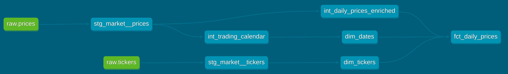
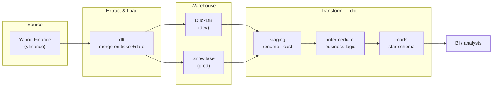

# 🧩 Modern Data Stack End-to-End — ELT with dlt, dbt & DuckDB

> A complete ELT pipeline on the modern Analytics Engineering stack: declarative ingestion with dlt,
> layered transformation with dbt, and a dimensional model ready for BI — built on **real stock-market
> data** and portable from DuckDB (dev) to **Snowflake** (prod).

**✅ Verified build:** `dbt build` → **7 models + 22 tests, 0 errors** on real market data —
10 tickers, ~2 years, **5,010** daily rows.



---

## 📋 Table of Contents

- [Context](#-context)
- [Business Problem](#-business-problem)
- [Architecture](#️-architecture)
- [Data](#️-data)
- [Methodology](#-methodology)
- [Dimensional Model](#-dimensional-model)
- [Results](#-results-verified-build)
- [Design Decisions](#-design-decisions)
- [Tech Stack](#️-tech-stack)
- [Repository Structure](#-repository-structure)
- [How to Reproduce](#️-how-to-reproduce)
- [AI & Responsible Use](#-ai--responsible-use)
- [Next Steps](#-next-steps)
- [Contact](#-contact)

---

## 🎯 Context

Modern data teams dropped hand-crafted ETL in favor of ELT: load first, transform inside the warehouse with
version-controlled SQL. This project implements that pattern end-to-end, from raw market data to a
BI-ready star schema — the foundation the other Analytics Engineering projects build on.

## ❓ Business Problem

How do we turn raw stock-market data (daily prices + ticker metadata) into trustworthy, versioned,
documented analytical models that a BI team can consume without rework — and keep the same models running
on both a zero-cost local warehouse and a production cloud warehouse?

## 🏗️ Architecture



**Warehouse portability is a property of the whole pipeline, not just dbt.** Both halves point at the same
target: the dlt destination is selected by `DESTINATION_TYPE`, and dbt switches with `--target`. Swapping
only the dbt profile would leave it querying a warehouse where the raw tables were never loaded.

## 🗂️ Data

- **Source:** Yahoo Finance via `yfinance` (free, no API key) — daily OHLCV prices + ticker metadata
  (name, sector, industry) for a basket of 10 sector-diverse large caps.
- **Volume (current build):** 10 tickers × ~2 years = **5,010 daily price rows**, covering
  **2024-07-15 → 2026-07-14** (501 trading days).
- **Grain of raw prices:** one row per ticker per trading day.
- **Entities:** `prices` (time series), `tickers` (descriptive metadata).
- **The window rolls:** the pipeline pulls `period="2y"` relative to the run date, so a reproduction run
  later will report a later window and a slightly different row count. The figures above are the snapshot
  of the documented build, not a constant.
- **Known limitations:** prices are unadjusted (`auto_adjust=False`), so splits and dividends are not
  back-propagated; `daily_return` is therefore a raw close-to-close change, not a total return.

## 🔍 Methodology

**Kimball dimensional modeling** on an ELT backbone:

1. **Ingestion (dlt):** incremental load of prices (merge on `ticker + date`) and ticker metadata into the
   warehouse — no duplication on re-run.
2. **Staging (dbt):** one model per source table — rename, type, standardize. No joins here.
3. **Intermediate (dbt):** business logic and enrichments — `daily_return`, calendar attributes.
4. **Marts (dbt):** star schema — fact and dimension tables ready for BI.
5. **Documentation & lineage:** `dbt docs` with model/column descriptions and the lineage graph above.

## ⭐ Dimensional Model

Star schema:

- **Fact:** `fct_daily_prices` — grain = **one row per ticker per trading day** (open, high, low, close,
  volume, daily return).
- **Dimensions:** `dim_tickers` (name, sector, industry), `dim_dates` (calendar attributes).
- Grain and join keys documented in the model `.yml`.

The grain was written down before the SQL, and the fact carries a surrogate key built from
`ticker + trade_date` — a `unique` test on that key is what proves the grain holds.

## ✅ Results (verified build)

`dbt build` runs clean on real market data — **7 models, 22 tests, 0 errors**:

| Model | Layer | Rows | Grain |
| --- | --- | --- | --- |
| `fct_daily_prices` | mart | 5,010 | one row per ticker per trading day |
| `dim_tickers` | mart | 10 | one row per ticker |
| `dim_dates` | mart | 501 | one row per trading day |

Models by layer: **2 staging** (views) · **2 intermediate** (views) · **3 marts** (tables).

Tests: `not_null` + `unique` on every key and `relationships` from the fact to both dimensions —
**22 passing, 0 failing**.

> Counts come from `target/run_results.json` (`{'model': 7, 'test': 22}`), not from dbt's console summary —
> the `Done. PASS=29` line sums models *and* tests, and reading it as a test count is an easy way to publish
> a number that isn't true.

## 🤔 Design Decisions

- **ELT over ETL:** transformation is versioned SQL inside the warehouse, auditable via Git.
- **dlt over hand-rolled scripts:** declarative ingestion with schema evolution and incremental load built in.
- **DuckDB (dev) + Snowflake (prod) on the same dbt project:** zero-cost local development, one target
  switch to a production cloud warehouse — demonstrates **warehouse portability**.
- **staging / intermediate / marts:** the official dbt convention, legible to any Analytics Engineer.
  Business logic lives in `intermediate/`, so marts stay thin — keys and joins only.
- **`dim_dates` built from observed trading days, not a full date spine:** the calendar contains only days
  the market was actually open, so a missing date is a real signal rather than an expected gap.

## 🛠️ Tech Stack

| Category | Tool |
| --- | --- |
| Ingestion (EL) | dlt |
| Warehouse | DuckDB (dev) · Snowflake (prod) |
| Transformation (T) | dbt Core |
| Languages | SQL, Python, Jinja |
| Packages | dbt_utils |
| Versioning | Git / GitHub |

## 📁 Repository Structure

- `ingestion/` — dlt pipeline (yfinance → warehouse)
- `dbt_project/models/staging/` — staging models + sources
- `dbt_project/models/intermediate/` — business logic and enrichments
- `dbt_project/models/marts/` — facts and dimensions
- `dbt_project/` — `dbt_project.yml`, `profiles.yml` (dev/prod), `packages.yml`
- `docs/` — lineage graph

## ⚙️ How to Reproduce

```bash
# 1. Create the environment (uv)
uv venv && source .venv/bin/activate
uv pip install -r requirements.txt

# 2. Ingest real market data into DuckDB
python ingestion/pipeline.py

# 3. Build the models and tests
cd dbt_project
dbt deps
dbt build --profiles-dir .        # dev target = DuckDB

# 4. Generate docs + lineage
dbt docs generate --profiles-dir . && dbt docs serve --profiles-dir .
```

### Running against Snowflake

Point **both** the ingestion and dbt at the cloud warehouse:

```bash
export SNOWFLAKE_ACCOUNT=... SNOWFLAKE_USER=... SNOWFLAKE_PASSWORD=...
export SNOWFLAKE_DATABASE=ANALYTICS SNOWFLAKE_WAREHOUSE=COMPUTE_WH SNOWFLAKE_ROLE=TRANSFORMER

DESTINATION_TYPE=snowflake python ingestion/pipeline.py   # load raw into Snowflake
cd dbt_project && dbt build --target prod --profiles-dir . # same models, cloud warehouse
```

Credentials are read from environment variables only — nothing is committed.

## 🧠 AI & Responsible Use

Subtle, validated use of AI: an LLM drafts the **first version of the column descriptions** in the dbt
`schema.yml` files from the data profile; every description is then **reviewed and corrected by hand**
before commit. AI accelerates documentation; the human owns correctness.

## 🚀 Next Steps

- Advanced tests + CI (natural evolution: project **AE-02**).
- Connect a BI tool to the marts for real consumption.
- Add a semantic layer over the marts (project **AE-03**).

## 📬 Contact

LinkedIn | Portfolio | Email
